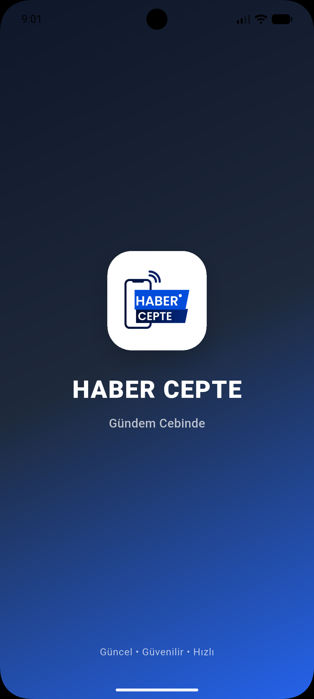
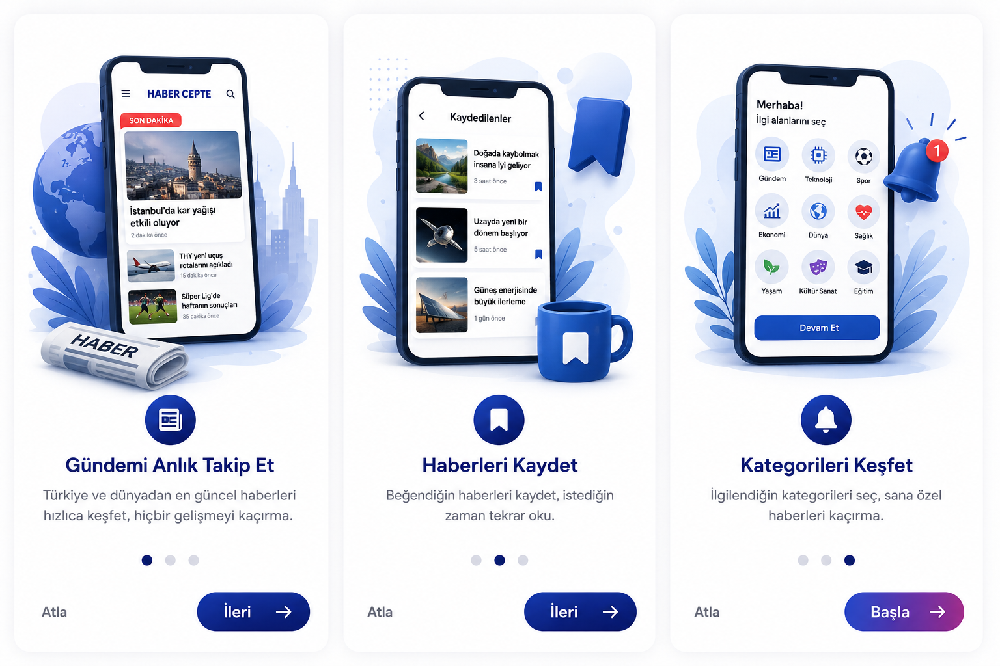
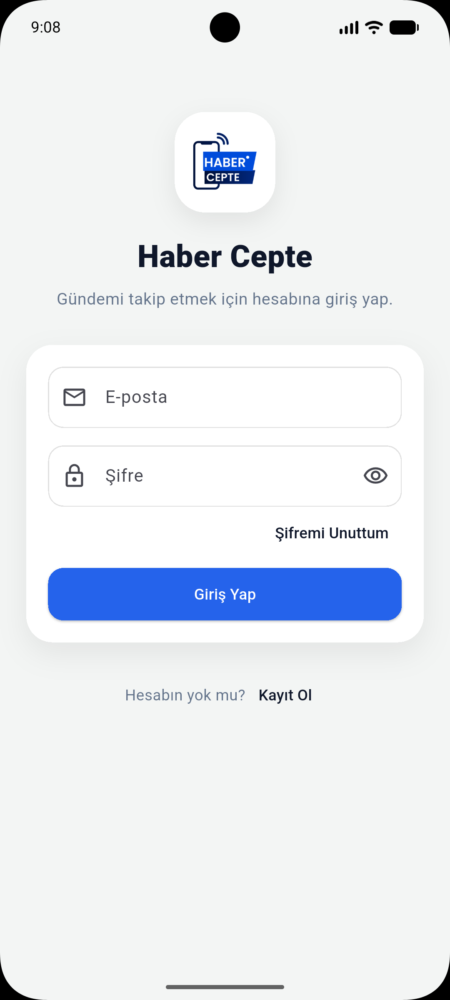
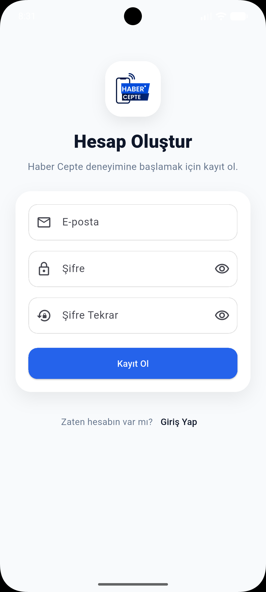
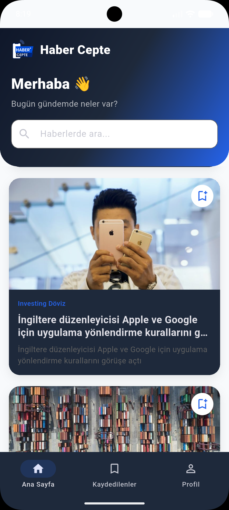
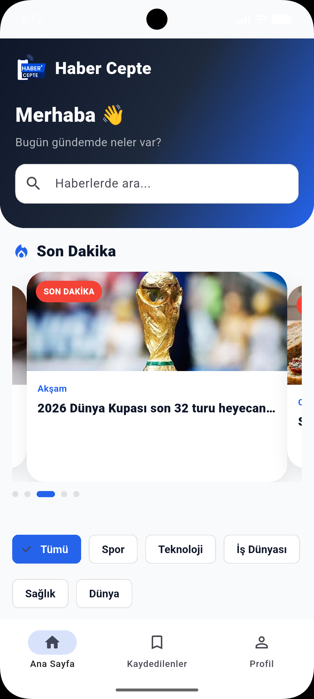
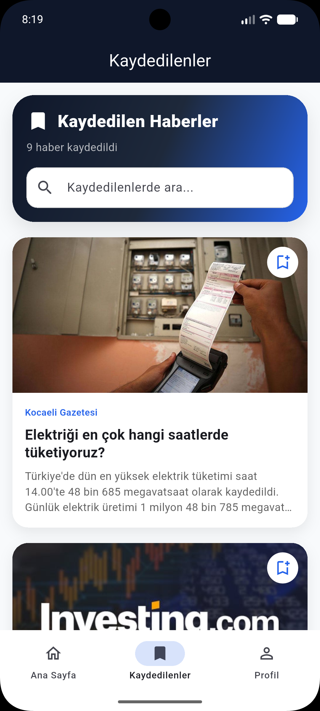
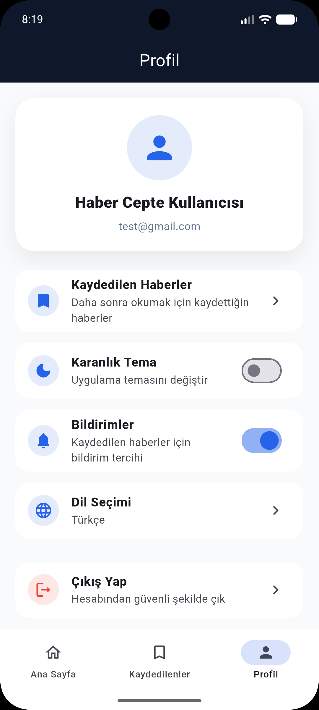
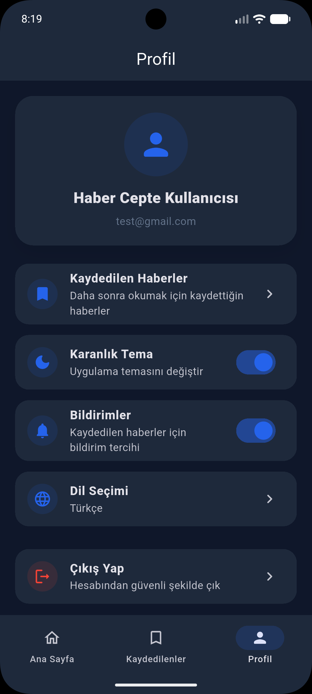

# 📰 HaberCepte

<p align="center">
  
</p>

<p align="center">
Flutter ile geliştirilmiş modern, hızlı ve kullanıcı dostu haber uygulaması.
</p>

<p align="center">


</p>

---

# 📖 Proje Hakkında

**HaberCepte**, kullanıcıların güncel haberleri farklı kategoriler altında takip edebildiği, haberleri kaydedebildiği, karanlık tema ve çoklu dil desteği sunan modern bir mobil haber uygulamasıdır.

Bu uygulama **Flutter Bitirme Projesi** kapsamında geliştirilmiştir.

---

# 🎯 Amaç

- Güncel haberleri kullanıcıya hızlı ulaştırmak
- Modern Flutter mimarisi kullanmak
- Firebase servisleriyle gerçek kullanıcı yönetimi sağlamak
- Responsive ve profesyonel bir arayüz oluşturmak

---

# 🚀 Kullanılan Teknolojiler

| Teknoloji | Açıklama |
|-----------|----------|
| Flutter | Mobil uygulama geliştirme |
| Dart | Programlama dili |
| Firebase Authentication | Kullanıcı giriş sistemi |
| Cloud Firestore | Veritabanı |
| Firebase Cloud Messaging | Bildirim altyapısı |
| Hive | Yerel veri saklama |
| Flutter Bloc (Cubit) | State Management |
| GoRouter | Sayfa yönetimi |
| REST API | Haber servisi |
| Localization | Türkçe / İngilizce |
| Material Design 3 | Modern arayüz |

---

# 📱 Uygulama Özellikleri

## 👤 Kullanıcı

- Splash Screen
- Onboarding
- Kayıt Ol
- Giriş Yap
- Şifremi Unuttum

---

## 📰 Haberler

- Güncel haberler
- Son Dakika Slider
- Kategori filtreleme
- Haber arama
- Haber detay sayfası
- Haber paylaşma
- Kaynak bilgisi

---

## ❤️ Favoriler

- Haberi kaydetme
- Firestore senkronizasyonu
- Favorilerde arama
- Swipe to Delete

---

## ⚙️ Profil

- Dark Mode
- Türkçe / İngilizce
- Bildirim altyapısı
- Çıkış Yap

---

## 🔥 Firebase

- Authentication
- Firestore
- Firebase Messaging
- Token Kaydı

---

# 📂 Proje Yapısı

```
lib
│
├── app
│   ├── routes
│   ├── views
│   └── app.dart
│
├── core
│   ├── cache
│   ├── localization
│   ├── notifications
│   ├── theme
│   └── widgets
│
├── l10n
│
├── firebase_options.dart
│
└── main.dart
```

---

# 📸 Uygulama Görselleri

## Splash Screen



---

## Onboarding



---

## Login



---

## Register



---

## Ana Sayfa




---

## Son Dakika Slider



---

## Kategori Filtreleme


---

## Haber Detay


---

## Kaydedilen Haberler



---

## Profil



---

## Dark Mode



---

## English Language


---

# 🔔 Bildirim Altyapısı

Firebase Cloud Messaging (FCM) kullanılarak bildirim altyapısı hazırlanmıştır.

Uygulama ilk açıldığında kullanıcıdan bildirim izni istenir ve cihaz token bilgisi Firestore veritabanına kaydedilir.

---

# 🌐 Çoklu Dil

Desteklenen Diller

- 🇹🇷 Türkçe
- 🇬🇧 English

Localization altyapısı Flutter Gen-L10n kullanılarak geliştirilmiştir.

---

# 🌙 Tema

- Light Theme
- Dark Theme

Tema tercihi cihazda saklanmaktadır.

---

# ⚙️ Kurulum

```bash
git clone https://github.com/abdullahmolla/haber_cepte.git
```

```bash
cd haber_cepte
```

```bash
flutter pub get
```

```bash
flutter run
```

---

# Firebase Ayarları

Projeyi çalıştırabilmek için kendi Firebase projenizi oluşturmanız gerekmektedir.

Aşağıdaki dosyayı ekleyiniz.

```
android/app/google-services.json
```

---

# 👨‍💻 Geliştirici

## Abdullah Molla

Flutter Bitirme Projesi

2026

---

# ⭐ Proje Durumu

✅ Tamamlandı

---

# 📄 Lisans

Bu proje eğitim amaçlı geliştirilmiştir.